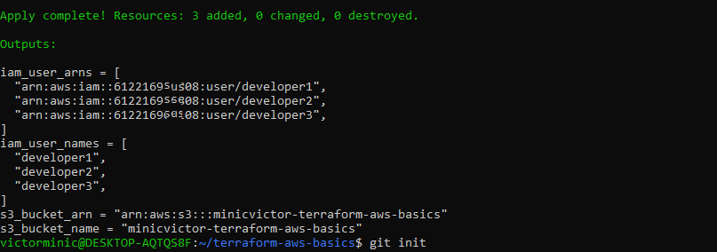

# Terraform AWS Basics

A Terraform project that provisions core AWS infrastructure for **ABC Cloud Solutions**, replacing manual resource creation via the AWS Management Console with Infrastructure as Code (IaC).

-----

## Table of Contents

- [Overview](#overview)
- [Architecture](#architecture)
- [Resources Created](#resources-created)
- [Provider Configuration](#provider-configuration)
- [Prerequisites](#prerequisites)
- [Project Structure](#project-structure)
- [Setup & Usage](#setup--usage)
- [Verifying the Deployment](#verifying-the-deployment)
- [Cleaning Up](#cleaning-up)
- [Security Notes](#security-notes)
- [Troubleshooting](#troubleshooting)
- [Author](#author)

-----

## Overview

This project uses Terraform to provision a small set of foundational AWS resources: three IAM users representing developers joining the team, and a single S3 bucket for storing project artifacts, with versioning enabled to protect against accidental overwrites or deletions.

The goal is to demonstrate IaC fundamentals — declarative resource definitions, provider version pinning, and a clean, reproducible workflow — rather than to build production-grade infrastructure.

## Architecture

```
 STEP 1                STEP 2               STEP 3                STEP 4
┌───────────┐      ┌─────────────┐     ┌─────────────┐      ┌──────────────┐
│  Write    │      │  terraform  │     │  terraform  │      │  terraform   │
│  .tf      │ ───► │    init     │ ──► │    plan     │ ───► │    apply     │
│  files    │      │             │     │             │      │              │
└───────────┘      └─────────────┘     └─────────────┘      └──────┬───────┘
provider.tf         Downloads the       Compares config              │
main.tf             hashicorp/aws       to current state,            │
outputs.tf          provider (~>6.0)    shows an execution           │
                     into .terraform/    plan (add/change/            │
                                         destroy) — nothing           │
                                         is created yet                │
                                                                       ▼
                                                          ┌─────────────────────────┐
                                                          │   terraform.tfstate     │
                                                          │  (local state file —    │
                                                          │   records what exists,  │
                                                          │   never committed)      │
                                                          └────────────┬────────────┘
                                                                       │
                                                                       ▼
                                                          ┌─────────────────────────┐
                                                          │      AWS Account        │
                                                          │      (us-east-1)        │
                                                          └────────────┬────────────┘
                                          ┌────────────────────────────┼───────────────────────┐
                                          ▼                            ▼                        ▼
                                ┌─────────────────┐                                   ┌─────────────────────┐
                                │  aws_iam_user    │                                   │   aws_s3_bucket      │
                                │  (for_each loop) │                                   │  + aws_s3_bucket_    │
                                └────────┬─────────┘                                   │    versioning        │
                        ┌────────────────┼────────────────┐                          └───────────┬───────────┘
                        ▼                ▼                ▼                                      ▼
                 ┌────────────┐  ┌────────────┐   ┌────────────┐                     ┌─────────────────────────┐
                 │ developer1 │  │ developer2 │   │ developer3 │                     │ minicvictor-terraform-  │
                 │  IAM User  │  │  IAM User  │   │  IAM User  │                     │      aws-basics         │
                 └────────────┘  └────────────┘   └────────────┘                     │ (Versioning: Enabled)   │
                                                                                       └─────────────────────────┘
```

### Step-by-step explanation

**Step 1 — Write the `.tf` files**
You author `provider.tf` (which provider and region to use), `main.tf` (what resources to create), and `outputs.tf` (what values to display after creation). Nothing exists in AWS yet — this is just declarative code sitting on your machine.

**Step 2 — `terraform init`**
Terraform reads `provider.tf`, sees it needs `hashicorp/aws` version `~> 6.0`, and downloads that provider plugin into a local `.terraform/` folder. This folder is excluded from Git via `.gitignore` since it can always be regenerated by re-running `init`.

**Step 3 — `terraform plan`**
Terraform compares your `.tf` files against its current understanding of what exists (via the state file, or nothing at all on a first run) and prints an execution plan: what will be created, changed, or destroyed. This is a **dry run** — no real infrastructure is touched yet, which is what makes it safe to review before committing to changes.

**Step 4 — `terraform apply`**
Once you confirm with `yes`, Terraform executes the plan against the real AWS API. This is the only step that actually creates resources.

**State file (`terraform.tfstate`)**
As `apply` runs, Terraform records everything it creates in a local state file. This file is Terraform’s source of truth for “what currently exists” on future `plan`/`apply` runs — it’s why Terraform can tell you it needs to create 3 users the first time, but “no changes” the second time you run `apply` with the same config. It’s excluded from Git because it can contain sensitive resource metadata.

**AWS Account (us-east-1)**
The actual environment where resources land, as fixed by the `region` argument in `provider.tf`.

**Resource fan-out**

- The single `aws_iam_user.developers` block uses a `for_each` loop over `["developer1", "developer2", "developer3"]`, so **one block in code produces three independent IAM users** in AWS.
- The `aws_s3_bucket` and `aws_s3_bucket_versioning` resources are linked — the second one references the first (`bucket = aws_s3_bucket.main.id`) to turn on versioning for that specific bucket.

In short: **write → init → plan → apply**, with the state file tracking reality in between, resulting in real, reproducible AWS resources.

## Resources Created

|Resource                          |Type                      |Details                                       |
|----------------------------------|--------------------------|----------------------------------------------|
|`developer1`                      |`aws_iam_user`            |Tagged `Environment=Development`, `Owner=Egwu`|
|`developer2`                      |`aws_iam_user`            |Tagged `Environment=Development`, `Owner=Egwu`|
|`developer3`                      |`aws_iam_user`            |Tagged `Environment=Development`, `Owner=Egwu`|
|`minicvictor-terraform-aws-basics`|`aws_s3_bucket`           |Globally unique bucket name                   |
|Bucket versioning                 |`aws_s3_bucket_versioning`|Status: `Enabled`                             |

**Tags applied to all resources:**

```
Environment = Development
Owner       = Egwu
```

## Provider Configuration

|Setting           |Value                             |
|------------------|----------------------------------|
|Provider          |`hashicorp/aws`                   |
|Version constraint|`~> 6.0` (allows 6.x, blocks 7.0+)|
|Region            |`us-east-1`                       |

The `~> 6.0` constraint means Terraform will use any 6.x release (e.g. 6.1, 6.4) but will refuse to upgrade to a 7.x release automatically, protecting against breaking changes.

## Prerequisites

Before running this project you need:

1. **An AWS account** with permissions to create IAM users and S3 buckets.
1. **Terraform CLI** (v1.5 or later) — [install guide](https://developer.hashicorp.com/terraform/install)
   
   ```bash
   terraform -version
   ```
1. **AWS CLI**, configured with valid credentials:
   
   ```bash
   aws configure
   ```
   
   You’ll be prompted for:
- AWS Access Key ID
- AWS Secret Access Key
- Default region (`us-east-1`)
- Output format (`json` recommended)
   
   Terraform reads these credentials automatically from your local AWS CLI configuration (`~/.aws/credentials`) — they are **never** stored in this repository.
1. **Git**, to clone and version the project.

## Project Structure

```
terraform-aws-basics/
├── provider.tf     # AWS provider block and version constraints
├── main.tf         # IAM user and S3 bucket resource definitions
├── outputs.tf      # Values printed after a successful apply
├── .gitignore      # Excludes state files, secrets, and .terraform/
└── README.md       # This file
```

## Setup & Usage

### 1. Clone the repository

```bash
git clone https://github.com/minicvictor/terraform-aws-basics.git
cd terraform-aws-basics
```

### 2. Initialize Terraform

Downloads the AWS provider plugin and sets up the working directory.

```bash
terraform init
```

### 3. Format and validate (optional but recommended)

```bash
terraform fmt
terraform validate
```

### 4. Review the execution plan

Shows exactly what Terraform intends to create, without making any changes yet.

```bash
terraform plan
```

### 5. Apply the configuration

```bash
terraform apply
```

Type `yes` when prompted to confirm.

### 6. Review the outputs

After a successful apply, Terraform prints:

- `iam_user_names` — names of the created IAM users
- `iam_user_arns` — their ARNs
- `s3_bucket_name` — the bucket name
- `s3_bucket_arn` — the bucket ARN

## Deployment Output

After running `terraform apply` and confirming with `yes`, Terraform successfully provisioned all resources and printed the following outputs:

```
Outputs:

iam_user_arns = [
  "arn:aws:iam::612216xxx808:user/developer1",
  "arn:aws:iam::612216xxx808:user/developer2",
  "arn:aws:iam::612216xxx808:user/developer3",
]
iam_user_names = [
  "developer1",
  "developer2",
  "developer3",
]
s3_bucket_arn = "arn:aws:s3:::minicvictor-terraform-aws-basics"
s3_bucket_name = "minicvictor-terraform-aws-basics"
```

This confirms:

- All three IAM users (`developer1`, `developer2`, `developer3`) were created successfully, each with a unique ARN under the AWS account.
- The S3 bucket `minicvictor-terraform-aws-basics` was created successfully with a valid ARN.

**Screenshot of AWS Console showing the created resources:**

 

## Verifying the Deployment

You can confirm the resources exist either via the AWS Console or the CLI:

```bash
# Check IAM users
aws iam list-users --query "Users[].UserName"

# Check the S3 bucket
aws s3api head-bucket --bucket minicvictor-terraform-aws-basics

# Check bucket versioning status
aws s3api get-bucket-versioning --bucket minicvictor-terraform-aws-basics
```

## Cleaning Up

To avoid ongoing AWS charges and remove all resources created by this project:

```bash
terraform destroy
```

Type `yes` when prompted. This permanently deletes the IAM users and the S3 bucket (and its contents, if empty).

## Security Notes

- **No AWS credentials are hardcoded** anywhere in this project. Terraform relies entirely on the AWS CLI configuration or environment variables (`AWS_ACCESS_KEY_ID`, `AWS_SECRET_ACCESS_KEY`) on the machine running it.
- **State files are excluded from version control.** `terraform.tfstate` can contain sensitive information (including resource IDs and, depending on the resource type, secrets) and should never be committed. See `.gitignore`.
- **Local state only.** This project uses local state for simplicity. In a team or production setting, use a **remote backend** (e.g., an S3 bucket with DynamoDB state locking) so multiple engineers can collaborate safely without state conflicts.
- **Bucket name uniqueness.** S3 bucket names are globally unique across *all* AWS accounts. If `minicvictor-terraform-aws-basics` is already taken, update the `bucket` argument in `main.tf` before applying.
  

## Author

**Egwu** — Cloud & DevOps Engineering Student
GitHub: [@minicvictor](https://github.com/minicvictor)
